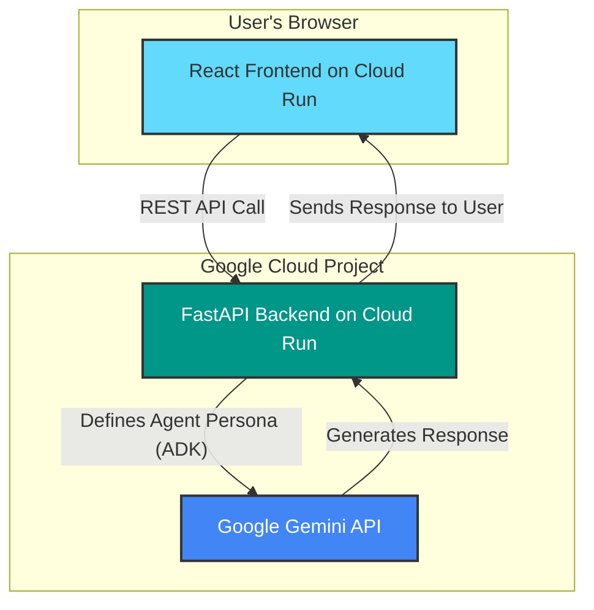

# 💡 EconoMind - AI-Powered Economics Learning Platform

**Submission for the Cloud Run Hackathon 2025 - AI Agents Category**

EconoMind is an interactive educational platform that uses two specialized AI agents, built with the **Google Agent Development Kit (ADK)**, to teach economics:
- 🎓 **The Professor**: Explains concepts with clear theory and examples
- 💪 **The Coach**: Provides practical exercises and hands-on learning

## 🏗️ Architecture

The application is designed as a modern microservices architecture, fully deployed on Google Cloud Run.

- **Frontend**: A responsive React (Vite) application using Tailwind CSS, which communicates with the backend via REST API calls.
- **Backend**: A Python FastAPI API that exposes endpoints for the AI agents. It uses the **Google ADK** to define and run the agents, which are powered by Gemini models through a Vertex AI integration.

## 🚀 Quick Start (Local Development)

### Prerequisites
- Node.js 18+
- Python 3.11+
- `gcloud` CLI installed and authenticated (`gcloud auth login`)

### Local Development

**Backend:**
```bash
# Authenticate for Google Cloud API access (required by ADK/Vertex AI)
gcloud auth application-default login

# Navigate to the backend directory
cd backend

# Install dependencies
pip install -r requirements.txt

# Set environment variables (replace with your project ID)
export GCP_PROJECT_ID="your-gcp-project-id"
export GCP_LOCATION="europe-west1"

# Start the server
python main.py
```

**Frontend:**
```bash
cd frontend
npm install
cp .env.example .env
# Update VITE_API_URL in .env if needed
npm run dev
```

## 🎯 Integration Guide for Hamdane

### Step 1: Get Gemini API Key
1. Go to Google AI Studio: https://makersuite.google.com/app/apikey
2. Create an API key
3. Save it securely

### Step 2: Update Backend with Gemini

In `backend/main.py`, replace the mock functions:

```python
import google.generativeai as genai
import os

# Configure Gemini
genai.configure(api_key=os.environ["GEMINI_API_KEY"])

def professor_agent(user_message: str, course_context: str = None) -> str:
    """Professor Agent with Gemini"""
    model = genai.GenerativeModel('gemini-pro')
    
    system_prompt = f'''You are an expert economics professor.
    Your role is to explain concepts clearly with examples.
    
    Course context: {course_context if course_context else "General economics"}
    
    Provide clear, educational responses with real-world examples.'''
    
    full_prompt = f"{system_prompt}\n\nStudent question: {user_message}"
    response = model.generate_content(full_prompt)
    return response.text

def coach_agent(user_message: str, course_context: str = None) -> str:
    """Coach Agent with Gemini"""
    model = genai.GenerativeModel('gemini-pro')
    
    system_prompt = f'''You are an economics coach focused on practical learning.
    Your role is to provide exercises, case studies, and hands-on practice.
    
    Course context: {course_context if course_context else "General economics"}
    
    Create actionable exercises and provide constructive feedback.'''
    
    full_prompt = f"{system_prompt}\n\nStudent request: {user_message}"
    response = model.generate_content(full_prompt)
    return response.text
```

### Step 3: Update requirements.txt

Uncomment this line in `backend/requirements.txt`:
```
google-generativeai==0.3.1
```

### Step 4: Test Locally

```bash
cd backend
export GEMINI_API_KEY="your-key"
python main.py
```

## 🌐 Deployment to Cloud Run

### Backend Deployment

```bash
cd backend

# Build and deploy
gcloud run deploy economind-backend \
  --source . \
  --platform managed \
  --region us-central1 \
  --allow-unauthenticated \
  --set-env-vars GEMINI_API_KEY="your-key"
```

### Frontend Deployment

```bash
cd frontend

# Update .env with backend URL
echo "VITE_API_URL=https://economind-backend-xxx.run.app" > .env

# Build and deploy
gcloud run deploy economind-frontend \
  --source . \
  --platform managed \
  --region us-central1 \
  --allow-unauthenticated
```

## 📁 Project Structure

```
economind-hackathon/
├── backend/
│   ├── main.py              # FastAPI app with agent endpoints
│   ├── requirements.txt     # Python dependencies
│   └── Dockerfile          # Cloud Run deployment
├── frontend/
│   ├── src/
│   │   ├── components/
│   │   │   ├── Home.jsx    # Landing page
│   │   │   ├── Courses.jsx # Course list
│   │   │   ├── Professor.jsx # Professor chat
│   │   │   └── Coach.jsx   # Coach chat
│   │   ├── App.jsx         # Main app component
│   │   └── index.css       # Tailwind styles
│   ├── Dockerfile          # Cloud Run deployment
│   ├── nginx.conf          # Nginx configuration
│   └── package.json        # Node dependencies
└── README.md               # This file
```

## 🎬 Demo Video Checklist

- [ ] Show landing page with both agents
- [ ] Demonstrate Professor explaining a concept
- [ ] Demonstrate Coach providing exercises
- [ ] Show course selection and context awareness
- [ ] Explain Cloud Run architecture
- [ ] Highlight Gemini AI integration
- [ ] Show responsive design

## 🏆 Hackathon Requirements

✅ Deployed on Cloud Run (both services)
✅ Uses AI Agents (Professor + Coach)
✅ Integrates Gemini API
✅ Public GitHub repository
✅ Architecture diagram (see below)
✅ Demo video (< 3 minutes)
✅ English documentation

## 📊 Architecture Diagram



## 🎯 Features

- **Dual AI Agents**: Specialized Professor and Coach roles
- **Course-Aware**: Context-specific responses based on selected course
- **Real-Time Chat**: Interactive conversations with both agents
- **Responsive Design**: Works on desktop and mobile
- **Serverless**: Fully deployed on Google Cloud Run
- **Scalable**: Auto-scales based on demand

## 📝 License

Built for Cloud Run Hackathon 2025

## 👨‍💻 Author

Hamdane - Solo Developer
