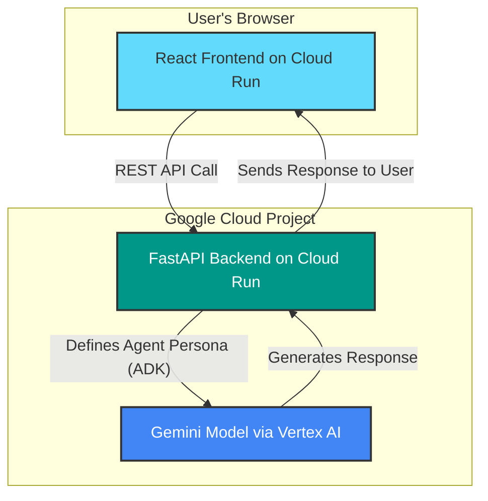

# 💡 EconoMind - AI-Powered Economics Learning Platform

**Submission for the Cloud Run Hackathon 2025 - AI Agents Category**

EconoMind is an interactive educational platform that uses two specialized AI agents, built with the **Google Agent Development Kit (ADK)**, to teach economics:
- 🎓 **The Professor**: Explains concepts with clear theory and examples
- 💪 **The Coach**: Provides practical exercises and hands-on learning

## 🏗️ Architecture

The application is designed as a modern microservices architecture, fully deployed on Google Cloud Run.

- **Frontend**: A responsive React (Vite) application using Tailwind CSS, which communicates with the backend via REST API calls.
- **Backend**: A Python FastAPI API that exposes endpoints for the AI agents. It uses the **Google ADK** to define and run the agents, which are powered by Gemini models through a Vertex AI integration.

## 🚀 Quick Start (Local Development)
 
 For detailed local development and deployment instructions, please refer to the `DEPLOYMENT.md` file. It contains all the necessary steps to run the frontend and backend, and to deploy them to Google Cloud Run.

## 🌐 Deployment to Cloud Run

 Full, detailed instructions are available in **`DEPLOYMENT.md`**.

 The key steps are:
1.  Set your `PROJECT_ID` and `REGION`.
2.  Enable the required Google Cloud APIs (Cloud Run, Vertex AI).
3.  Deploy the backend service using `gcloud run deploy`.
4.  Deploy the frontend service, providing the backend URL as an environment variable.

 ## 🎯 Features
 
 - **Dual AI Agents**: Specialized Professor and Coach roles built with the Google Agent Development Kit (ADK).
 - **Multi-Agent Collaboration (A2A Protocol)**: A bonus feature where the Professor explains a concept and the Coach immediately generates and proposes a relevant exercise, demonstrating Agent-to-Agent communication.
 - **Course-Aware**: Context-specific responses based on the selected course.
 - **Real-Time Chat**: Interactive conversations with both agents.
 - **Serverless**: Fully deployed on Google Cloud Run for scalability and cost-efficiency.
 - **Microservices**: Decoupled React frontend and Python FastAPI backend.
 - **Responsive Design**: The user interface works seamlessly on both desktop and mobile.

## 📁 Project Structure

```
economind-hackathon/
├── backend/
│   ├── main.py              # FastAPI app with agent endpoints
│   ├── requirements.txt     # Python dependencies
│   └── Dockerfile          # Cloud Run deployment
├── frontend/
│   ├── src/
│   │   ├── components/
│   │   │   ├── Home.jsx    # Landing page
│   │   │   ├── Courses.jsx # Course list
│   │   │   ├── Professor.jsx # Professor chat
│   │   │   └── Coach.jsx   # Coach chat
│   │   ├── App.jsx         # Main app component
│   │   └── index.css       # Tailwind styles
│   ├── Dockerfile          # Cloud Run deployment
│   ├── nginx.conf          # Nginx configuration
│   └── package.json        # Node dependencies
└── README.md               # This file
```

## 🎬 Demo Video Checklist

- [ ] Show landing page with both agents
- [ ] Demonstrate Professor explaining a concept
- [ ] Demonstrate Coach providing exercises
- [ ] Show course selection and context awareness
- [ ] Explain Cloud Run architecture
- [ ] Highlight Gemini AI integration
- [ ] Show responsive design

## 🏆 Hackathon Requirements

✅ Deployed on Cloud Run (both services)
✅ Uses AI Agents (Professor + Coach)
✅ Integrates Gemini API
✅ Public GitHub repository
✅ Architecture diagram (see below)
✅ Demo video (< 3 minutes)
✅ English documentation

## 📊 Architecture Diagram



## 🎯 Features

- **Dual AI Agents**: Specialized Professor and Coach roles
- **Course-Aware**: Context-specific responses based on selected course
- **Real-Time Chat**: Interactive conversations with both agents
- **Responsive Design**: Works on desktop and mobile
- **Serverless**: Fully deployed on Google Cloud Run
- **Scalable**: Auto-scales based on demand

## 📝 License

Built for Cloud Run Hackathon 2025

## 👤 Author

Hamdane - Solo Developer
